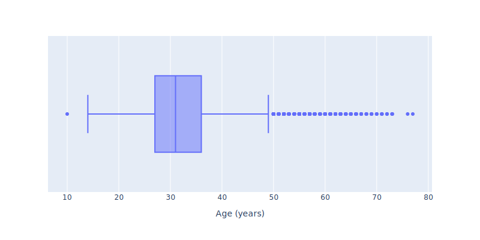
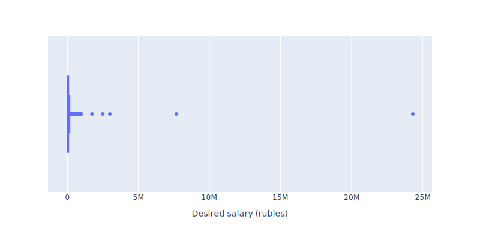

# Images from Project HeadHunter

## Data dependences investigation

### Task 1

[HTML-version](Plotly_html/Task1_histogram.html)

[HTML-version](Plotly_html/Task1_box.html)

### Task 2

[HTML-version](Plotly_html/Task2_histogram.html)

[HTML-version](Plotly_html/Task2_box.html)

### Task 3

[HTML-version](Plotly_html/Task3_histogram.html)

[HTML-version](Plotly_html/Task3_box.html)

### Additional plot 1

[HTML-version](Plotly_html/Additional1_histogram.html)

[HTML-version](Plotly_html/Additional1_box.html)

### Task 4

[HTML-version](Plotly_html/Task4_bar.html)

### Task 5

[HTML-version](Plotly_html/Task5_box.html)

### Task 6

[HTML-version](Plotly_html/Task6_bar.html)

### Task 7

[HTML-version](Plotly_html/Task7_heatmap.html)

### Task 8

[HTML-version](Plotly_html/Task8_scatter.html)

### Additional plot 2

[HTML-version](Plotly_html/Additional2_scatter.html)

### Additional plot 3

[HTML-version](Plotly_html/Additional3_scatter3D.html)

## Data cleaning

### Task 6

[HTML-version](Plotly_html/Cleaning6_histogram_log.html)

[HTML-version](Plotly_html/Cleaning6_histogram_basic.html)